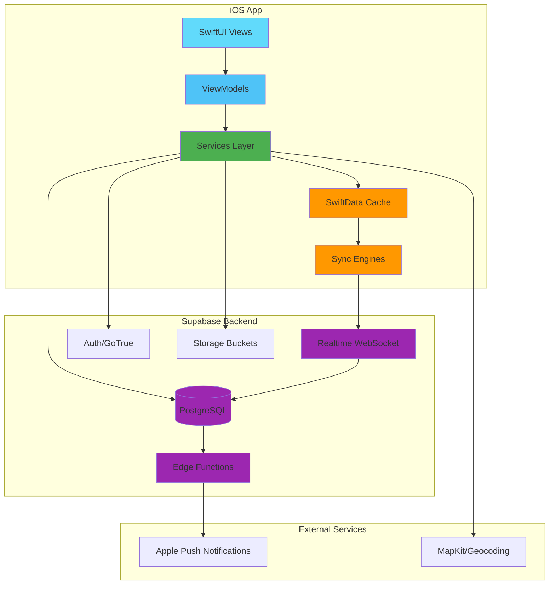
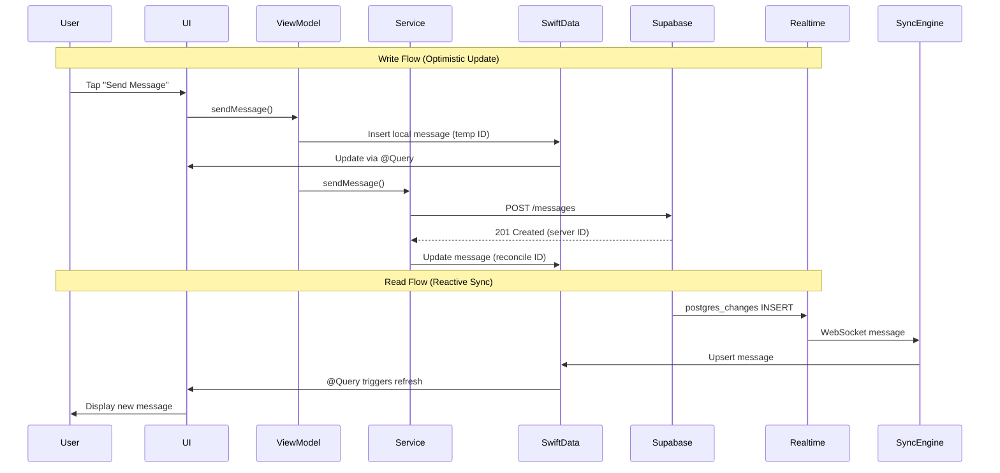
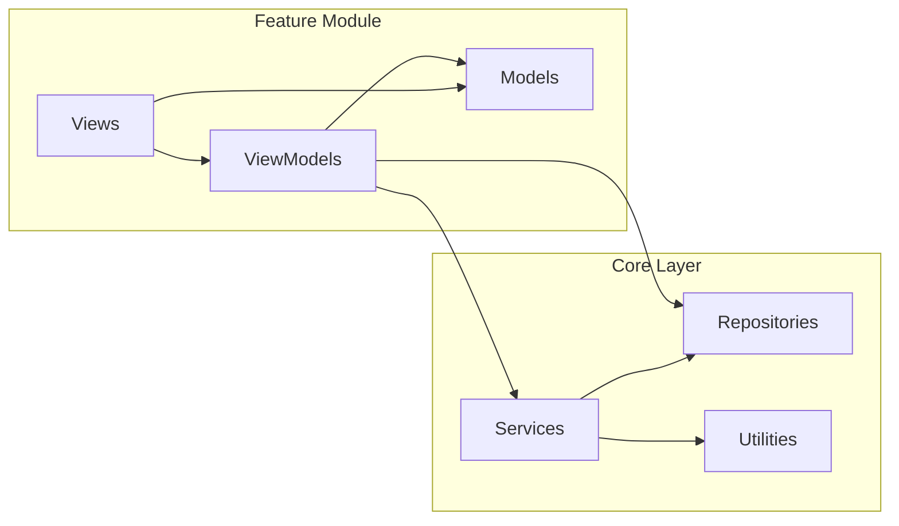
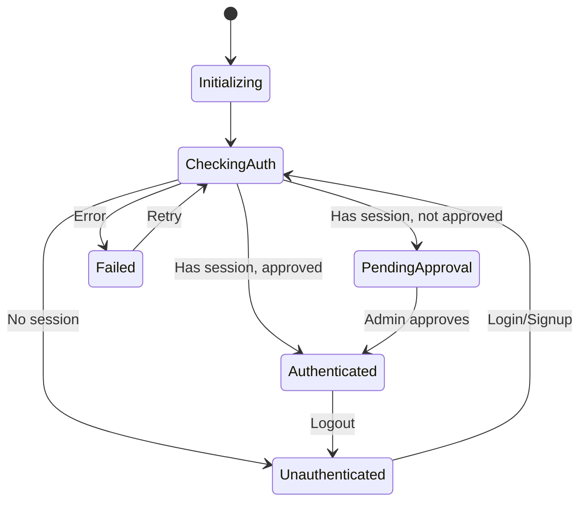
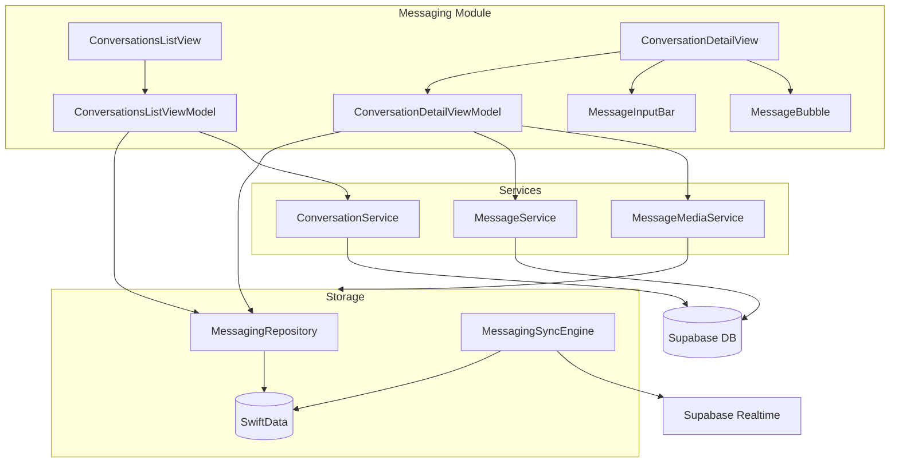
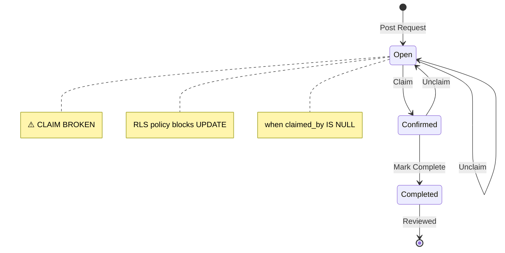
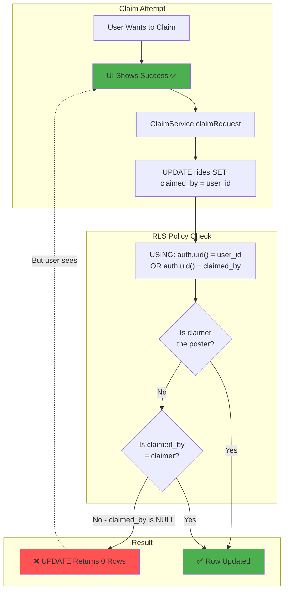

# Architecture Overview Diagram

Visual representation of the NaarsCars iOS architecture.

## System Architecture

## Data Flow Architecture

## Feature Module Structure

## Authentication Flow

## Messaging Architecture

## Request Lifecycle (Rides/Favors)

## Database RLS Issue (Current Bug)

links to [[/Users/bcolf/Documents/naars-cars-ios/VisualBrain/voicetree-7-2/1770515369146IEM.md]]
